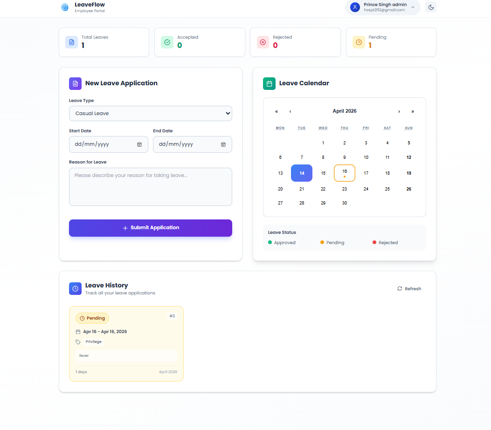
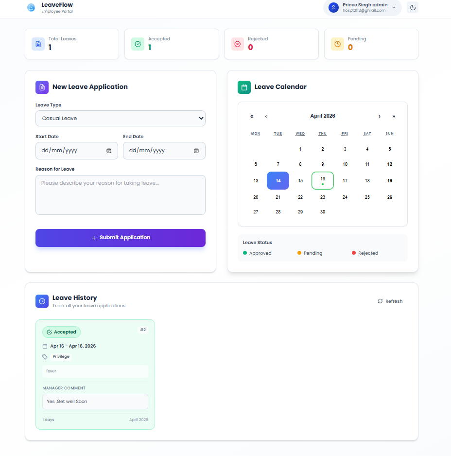
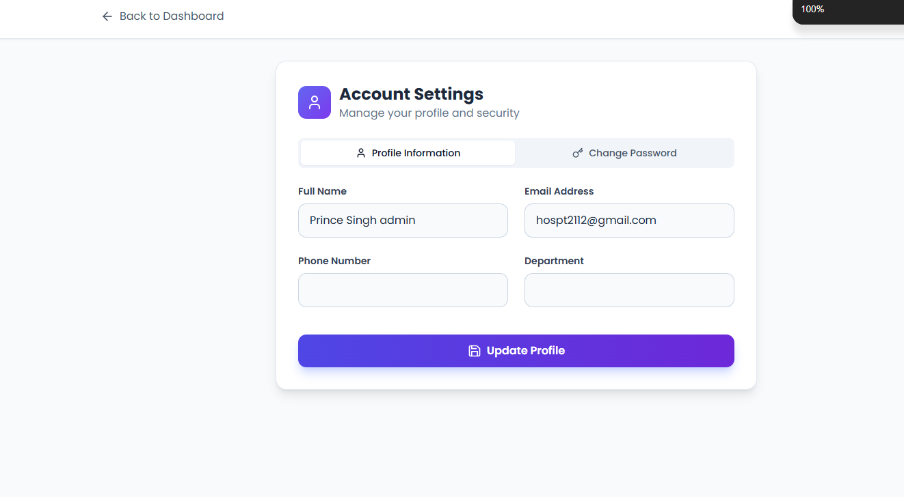
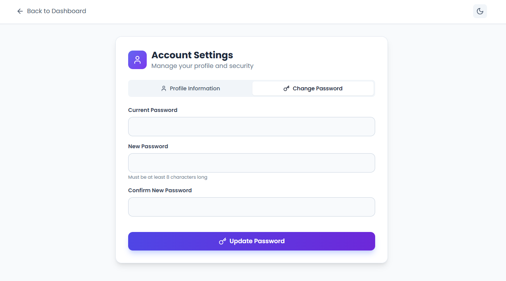
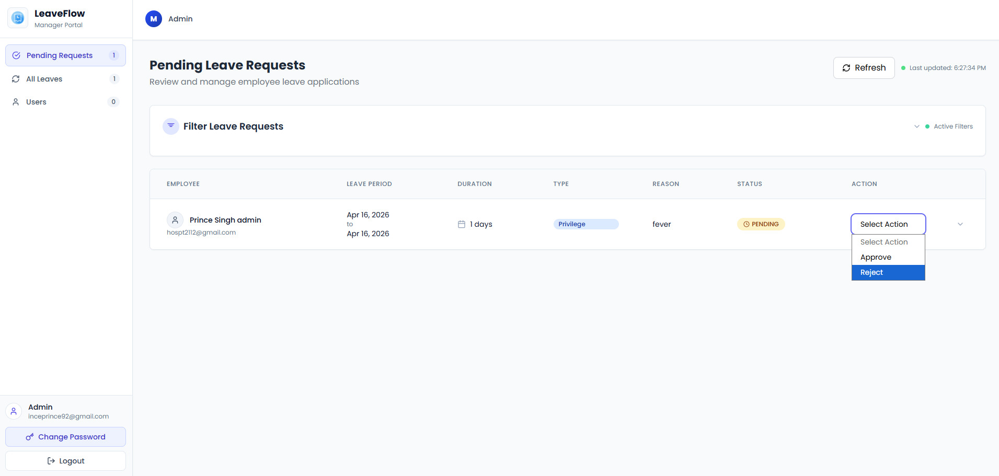
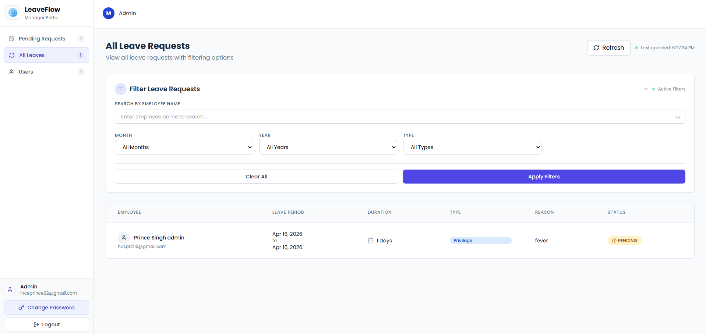
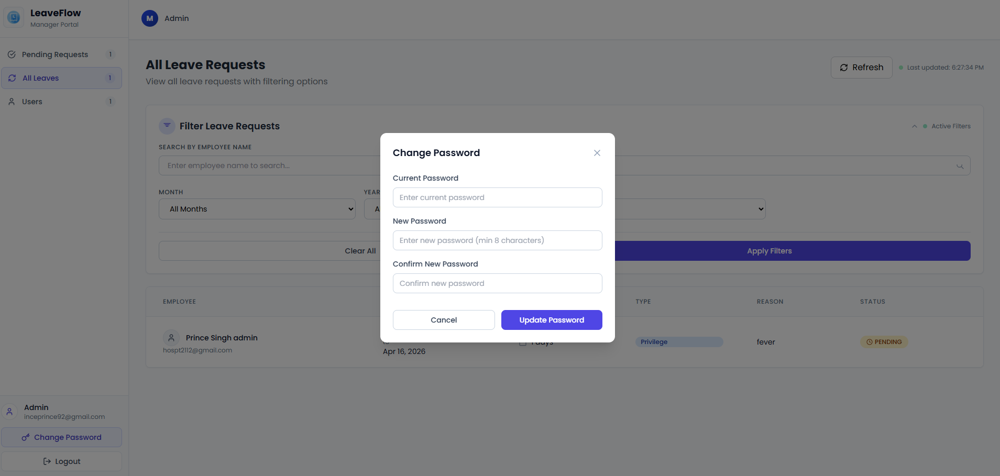

# LeaveFlow

LeaveFlow is a full-stack leave management system for employees and admins. This repository contains the frontend application built with React, Vite, Tailwind CSS, and Axios, while the backend API is powered by Spring Boot and deployed separately.

The app supports employee leave applications, leave history tracking, profile updates, and admin workflows for reviewing, approving, rejecting, and commenting on leave requests.

## Overview

- Employees can apply for leave, view leave history, update profile details, and change passwords.
- Admins can review pending requests, approve or reject with comments, filter leave records, and manage user-related leave visibility.
- The frontend connects to a live backend API hosted on Railway.
- Data is stored in PostgreSQL using NeonDB as the cloud database provider.

## Tech Stack

### Frontend

- React 18
- Vite
- React Router
- Tailwind CSS
- Axios
- Lucide React

### Backend

- Spring Boot
- REST APIs
- Railway for backend deployment
- PostgreSQL
- NeonDB cloud database

## Architecture

- Frontend: this repository, built with React and deployed as a static app
- Backend: Spring Boot service deployed on Railway
- Database: PostgreSQL hosted on NeonDB

The frontend uses the API base URL below:

```env
VITE_API_URL="https://leaveflowbackend-production.up.railway.app/api"
```

## Features

### Employee Features

- Login, signup, and forgot password flow
- Apply for casual, privilege, and half-day leaves
- Prevent overlapping leave selection in the UI
- View leave history with status and manager comments
- Update profile information
- Change password

### Admin Features

- View pending leave requests
- Approve or reject leave with comments
- View all leave requests with filters
- Search and review users
- View employee leave history
- Change password

## Routes

### Frontend Routes

- `/` -> redirects to `/login`
- `/login` -> employee login
- `/admin` -> redirects to `/admin/dashboard`
- `/admin/login` -> admin login
- `/signup` -> employee registration
- `/forgot-password` -> forgot password page
- `/dashboard` -> employee dashboard
- `/profile` -> employee profile page
- `/admin/dashboard` -> admin dashboard

### Backend API Routes Used By Frontend

Base URL:

```text
https://leaveflowbackend-production.up.railway.app/api
```

#### Auth

- `POST /auth/login`
- `POST /auth/register`

#### User

- `POST /v1/user/leaves`
- `GET /v1/user/leaves/my`
- `PUT /v1/user/profile`
- `PATCH /v1/user/change-password`

#### Manager

- `GET /manager/leaves`
- `GET /manager/leaves/all`
- `GET /manager/leaves/enhanced-filter`
- `PUT /manager/leaves/{id}/approve`
- `PUT /manager/leaves/{id}/reject`
- `GET /manager/users`
- `GET /manager/users/filter`
- `GET /manager/users/enhanced-filter`
- `GET /manager/users/stats`
- `GET /manager/users/{userId}/leaves`
- `GET /manager/users/{userId}/leaves/filter`
- `GET /manager/users/{userId}/leaves/status`

## Screenshots

### Employee Module

#### Leave Application



#### Leave History



#### User Profile



#### Change Password



### Admin Module

#### Pending Leave Requests



#### All Leaves With Filters



#### Change Password



## Getting Started

### Prerequisites

- Node.js 18 or later
- npm

### Installation

1. Clone the repository:

```bash
git clone <your-repository-url>
cd Leave_Management
```

2. Install dependencies:

```bash
npm install
```

3. Create the environment file:

```powershell
Copy-Item .env.example .env
```

4. Make sure `.env` contains the backend API URL:

```env
VITE_API_URL="https://leaveflowbackend-production.up.railway.app/api"
```

5. Start the development server:

```bash
npm run dev
```

## Available Scripts

- `npm run dev` starts the Vite development server
- `npm start` starts the same development server
- `npm run build` creates a production build
- `npm run preview` previews the production build locally

## Project Structure

```text
src/
  assets/
  components/
  contexts/
  hooks/
  pages/
  services/
public/
Screenshot/
```

## Deployment

### Frontend

- Built with Vite
- Dockerized using the included `Dockerfile`
- Served through Nginx in production

### Backend

- Built with Spring Boot
- Hosted on Railway
- Uses PostgreSQL on NeonDB

## Notes

- This repository primarily contains the frontend codebase.
- The backend service was implemented separately in Spring Boot.
- Backend integration in this project is done through the configured API endpoints.
- If Railway cold starts or the backend is under load, API requests may feel slower from the frontend.

## Credits

- Frontend integration, UI work, and project setup are maintained in this repository.
- The Spring Boot backend was built separately by my friend and is integrated here through the live API.
